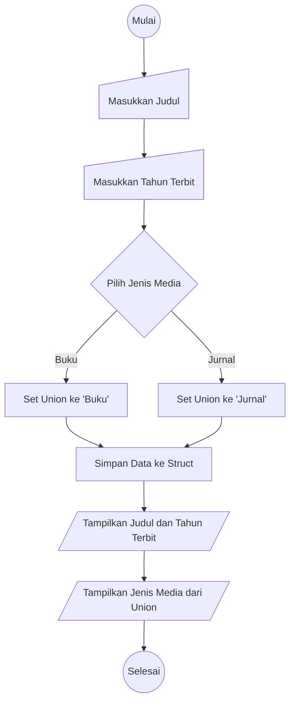

```mermaid
flowchart TD
    A@{ shape: circle, label: "Mulai" } --> B@{ shape: sl-rect, label: "Masukkan Judul" }
    B --> C@{ shape: sl-rect, label: "Masukkan Tahun Terbit" }
    C --> D{Pilih Jenis Media}
    D -->|Buku| E[Set Union ke 'Buku']
    D -->|Jurnal| F[Set Union ke 'Jurnal']
    E --> G[Simpan Data ke Struct]
    F --> G
    G --> H@{ shape: lean-r, label: "Tampilkan Judul dan Tahun Terbit"}
    H --> I@{ shape: lean-r, label: "Tampilkan Jenis Media dari Union" }
    I --> J@{ shape: circle, label: "Selesai" }
```