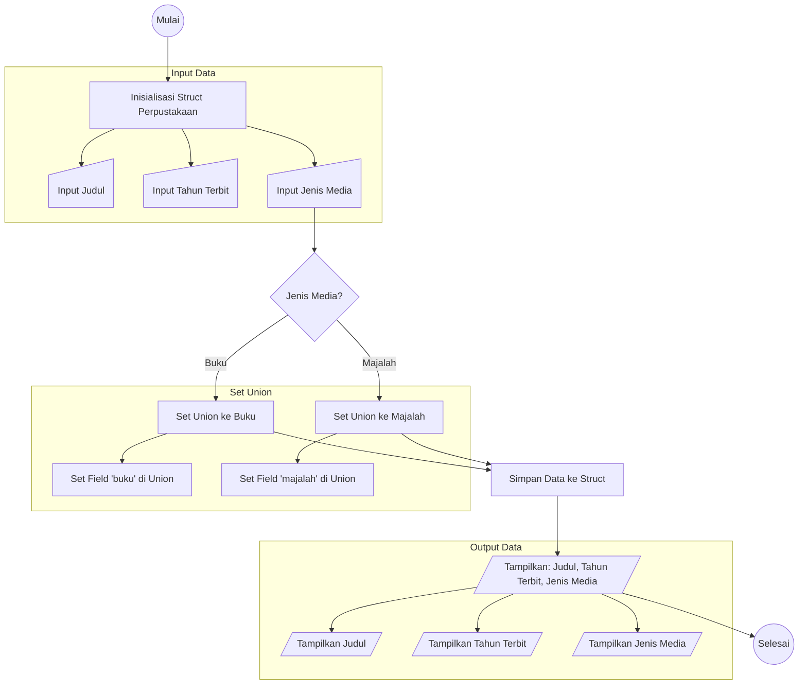

```mermaid
flowchart TD
    A@{ shape: circle, label: "Mulai" } --> B[Inisialisasi Struct Perpustakaan]

    subgraph "Input Data"
        B --> C1@{ shape: sl-rect, label: "Input Judul" }
        B --> C2@{ shape: sl-rect, label: "Input Tahun Terbit" }
        B --> C3@{ shape: sl-rect, label: "Input Jenis Media" }
    end

    C3 --> D{Jenis Media?}
    D -->|Buku| E[Set Union ke Buku]
    D -->|Majalah| F[Set Union ke Majalah]

    subgraph "Set Union"
        E --> E1[Set Field 'buku' di Union]
        F --> F1[Set Field 'majalah' di Union]
    end

    E --> G[Simpan Data ke Struct]
    F --> G
    G --> H@{ shape: lean-r, label: "Tampilkan: Judul, Tahun Terbit, Jenis Media" }

    subgraph "Output Data"
        H --> H1@{ shape: lean-r, label: "Tampilkan Judul" }
        H --> H2@{ shape: lean-r, label: "Tampilkan Tahun Terbit" }
        H --> H3@{ shape: lean-r, label: "Tampilkan Jenis Media" }
    end
    
    H --> I@{ shape: circle, label: "Selesai" }
```