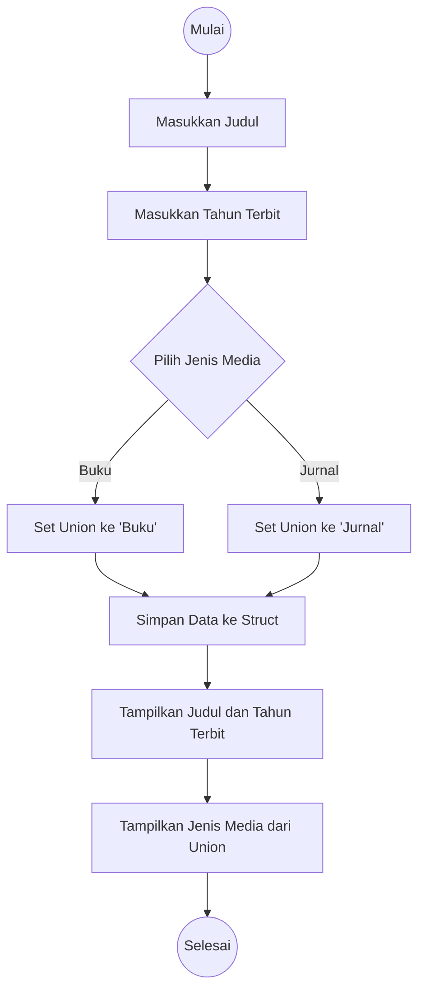

```mermaid
flowchart TD
    A@{ shape: circle, label: "Mulai" } --> B[Masukkan Judul]
    B --> C[Masukkan Tahun Terbit]
    C --> D{Pilih Jenis Media}
    D -->|Buku| E[Set Union ke 'Buku']
    D -->|Jurnal| F[Set Union ke 'Jurnal']
    E --> G[Simpan Data ke Struct]
    F --> G
    G --> H[Tampilkan Judul dan Tahun Terbit]
    H --> I[Tampilkan Jenis Media dari Union]
    I --> J@{ shape: circle, label: "Selesai" }
```